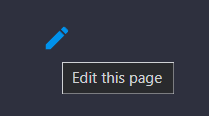

# Contributing

Thank you for investing your time in contributing to our project! Any contribution you make will be reflected on the <a href="https://chunky-dev.github.io/docs/" target="_blank">Chunky Manual</a>.

Read our [Code of Conduct](CODE_OF_CONDUCT.md) to keep our community approachable and respectable.

In this guide, you will get an overview of the contribution workflow from opening an issue, creating a PR, reviewing, and merging the PR.

When contributing to this repository, please consider discussing significant changes you wish to make via an issue or the <a href="https://discord.gg/4AgAUkCNUh" target="_blank">#docs</a> channel on our Discord server prior to making a change. Correcting spelling or grammar mistakes, or refining existing docs are not considered significant. A full rewrite of larger articles, adding new articles, new mkdocs plugins, etc. can be considered more significant changes.

## New contributor guide

To get an overview of the project, read the [README](README.md). Here are some resources to help you get started with open source contributions:

- <a href="https://docs.github.com/en/get-started/exploring-projects-on-github/finding-ways-to-contribute-to-open-source-on-github" target="_blank">Finding ways to contribute to open source on GitHub</a>

- <a href="https://docs.github.com/en/get-started/quickstart/set-up-git" target="_blank">Set up Git</a>

- <a href="https://docs.github.com/en/get-started/quickstart/github-flow" target="_blank">GitHub flow</a>

- <a href="https://docs.github.com/en/github/collaborating-with-pull-requests" target="_blank">Collaborating with pull requests</a>

## Getting started

### Issues

#### Create a new issue

If you spot a problem with the docs, <a href="https://docs.github.com/en/github/searching-for-information-on-github/searching-on-github/searching-issues-and-pull-requests#search-by-the-title-body-or-comments" target="_blank">search if an issue already exists</a>. If a related issue doesn't exist, you can <a href="https://github.com/chunky-dev/docs/issues/new" target="_blank">open a new issue</a>. 

#### Solve an issue

Scan through our <a href="https://github.com/chunky-dev/docs/issues" target="_blank">existing issues</a> to find one that interests you. You can narrow down the search using `labels` as filters. As a general rule, we don’t assign issues to anyone. If you find an issue to work on, you are welcome to open a PR with a fix.

### Make Changes

Be sure to read and understand the [style guide](STYLE_GUIDE.md) and the [versioning guide](VERSIONING_GUIDE.md) before making any changes.

#### Make changes in the UI

Click on the pencil icon at the top right of any docs page to make small changes such as a typo, sentence fix, or a broken link. This takes you to the `.md` file where you can make your changes and [create a pull request](#pull-request) for a review. 

#### Make changes locally

1. Fork the repository.

- Using GitHub Desktop:

  - <a href="https://docs.github.com/en/desktop/installing-and-configuring-github-desktop/getting-started-with-github-desktop" target="_blank">Getting started with GitHub Desktop</a> will guide you through setting up Desktop.

  - Once Desktop is set up, you can use it to <a href="https://docs.github.com/en/desktop/contributing-and-collaborating-using-github-desktop/cloning-and-forking-repositories-from-github-desktop" target="_blank">fork the repo</a>.

- Using the command line:

  - <a href="https://docs.github.com/en/github/getting-started-with-github/fork-a-repo#fork-an-example-repository" target="_blank">Fork the repo</a> so that you can make your changes without affecting the original project until you're ready to merge them.

- GitHub Codespaces:

  - <a href="https://docs.github.com/en/free-pro-team@latest/github/developing-online-with-codespaces/creating-a-codespace" target="_blank">Fork, edit, and preview</a> using <a href="https://github.com/features/codespaces" target="_blank">GitHub Codespaces</a> without having to install and run the project locally.

2. Install or update to **Python 3.5** or newer.

3. Install the required packages with pip by using the command, `pip3 install -r requirements.txt`.

4. Create a working branch and start with your changes!

##### Preview the local changes

1. Change the working directory to `./ChunkyDocs`.

2. Serve the site for development by using either the command, `CHUNKY_VERSION=20404 python -m mkdocs serve`, or the command, `CHUNKY_VERSION=20500 python -m mkdocs serve`, depending on the version of Chunky for which you want to serve documentation.

Alternatively, on Windows, you can run either "serve_stable.bat" or "serve_snapshot.bat", depending on the version of Chunky for which you want to build documentation.

### Commit your update

Commit the changes once you are happy with them.

### Pull Request

When you're finished with the changes, create a pull request, also known as a PR.

- Provide a short but descriptive name and for more complex changes an extended description.

- Don't forget to <a href="https://docs.github.com/en/issues/tracking-your-work-with-issues/linking-a-pull-request-to-an-issue" target="_blank">link PR to issue</a> if you are solving one.

- Enable the checkbox to <a href="https://docs.github.com/en/github/collaborating-with-issues-and-pull-requests/allowing-changes-to-a-pull-request-branch-created-from-a-fork" target="_blank">allow maintainer edits</a> so the branch can be updated for a merge.

Once you submit your PR, a Docs team member will review your proposal. We may ask questions or request for additional information.

- We may ask for changes to be made before a PR can be merged, either using <a href="https://docs.github.com/en/github/collaborating-with-issues-and-pull-requests/incorporating-feedback-in-your-pull-request" target="_blank">suggested changes</a> or pull request comments. You can apply suggested changes directly through the UI. You can make any other changes in your fork, then commit them to your branch.

- As you update your PR and apply changes, mark each conversation as <a href="https://docs.github.com/en/github/collaborating-with-issues-and-pull-requests/commenting-on-a-pull-request#resolving-conversations" target="_blank">resolved</a>.

- If you run into any merge issues, checkout this <a href="https://lab.github.com/githubtraining/managing-merge-conflicts" target="_blank">git tutorial</a> to help you resolve merge conflicts and other issues.

### Your PR is merged!

Congratulations :tada::tada: The Chunky team thanks you :sparkles:. 

Once your PR is merged, your contributions will be publicly visible on the <a href="https://chunky-dev.github.io/docs/" target="_blank">Chunky Manual</a>.

# Attribution

This Contributing guide is adapted from the <a href="https://github.com/github/docs/blob/main/CONTRIBUTING.md" target="_blank">contributing guide</a> for the <a href="https://docs.github.com/en" target="_blank">GitHub docs</a>.
