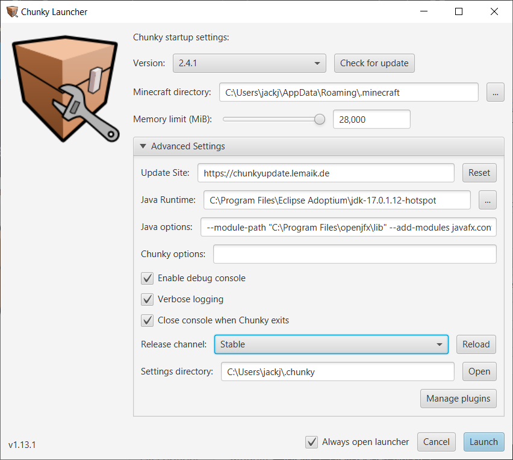
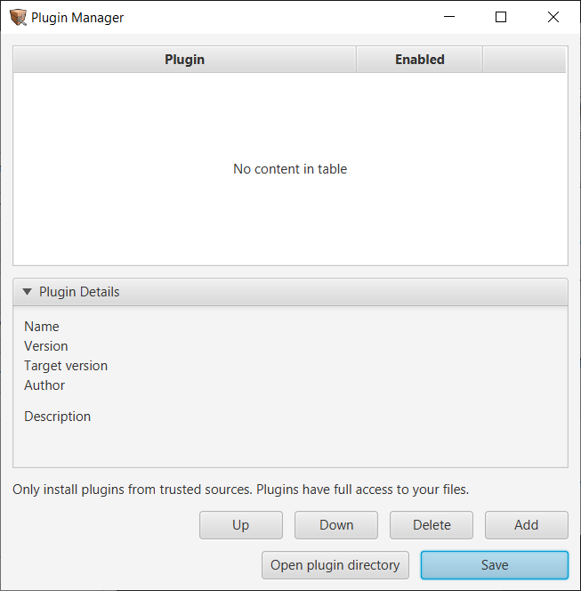

# Chunky Launcher

- `Version select` - Drop down list which allows you to pick a downloaded Chunky version.

- `Check for update` - Checks for updates on chosen update site.

- `Minecraft directory` - The directory Minecraft is installed to.

- `Memory limit (MiB)` - Default is 1024 MiB but it is highly recommended that you raise this value to better reflect the amount of memory in your system. Please take into account that the OS and other applications will also require some memory so don't over set this. If you cannot raise this past 2000 MiB double check your Java installation is 64 bit.

- `Always open Launcher` - Recommended you keep this checked. It is possible to access the launcher again via commandline or an option in Chunky but it's a bit more hassle.

---

## Advanced Settings

- `Update Site` - Changes source for updates.

	- `http://chunkyupdate.llbit.se/` should be used to obtain Chunky 1.X which is upto Minecraft version 1.12.2.

	- `http://chunkyupdate2.llbit.se/` is for llbit's Chunky 2.0 for Minecraft 1.13 however you will need to enable snapshots to get the latest version, `2.0beta6`, else you will be stuck with an older version.

	- `http://chunkyupdate.lemaik.de/` is the new default update site for Chunky 2.X.

- `Java Runtime` - Allows you to see and change the Runtime used for Chunky. Does not change the runtime used for the Launcher.

- `Java options` - See below for the list of Java options.

- `Chunky options` - See below for the list of Chunky options.

- `Enable debug console` & `Verbose logging` - The debug console is a seperate window that runs when you launch Chunky. As the name implies it is useful for debugging issues with Chunky and combined with Verbose logging, which enables addtional debug information, can be helpful in fixing bugs and crashes.

- `Close console when Chunky exits` - Typically this can be left enabled. If an exception/error causes chunky to crash it should still be possible to read the console.

- `Download snapshots` - Snapshots are nightly/alpha/beta builds of Chunky, depending on the update site used, and may be unstable.

- `Settings directory` - Does not let you change the settings directory but does let you see/access it.

- `Manage plugins` - The Plugin manager can be used to manage installed plugins. For a list of available plugins and their function, please refer to the [Plugins page](../plugins/plugins.md).

---

### Java options

- `-Dprism.order=sw` - Should the Chunky Launcher or the Chunky window appear blank when started this is caused by an issue with the JavaFX hardware renderer for Windows. The only known solution is to add the listed Java command/option. This may reduce responsiveness over `hw` but that mode is limited by your GPU drivers maximum texture size.

- `-DlogLevel=INFO` - `ERROR`,`WARNING`, `INFO` - Default is WARNING which will mean Chunky shows warnings for missing items. ERROR should disable missing item warnings.

[WIP PBR builds of Chunky](https://github.com/leMaik/chunky/tree/pbr) have addtional options required. These options may end up in the UI at a later point.

- `-Dchunky.pbr.specular=labpbr` - `labpbr`, `oldpbr` - Tells Chunky which format the specular map is in.

- `-Dchunky.pbr.updateMaterialDefaults=true` - Sets default materials to emittance=1, smoothness=0, metalness=1 such that the specular map is applied to all materials.

- `-Dchunky.pbr.normal=true` - Enables normal mapping on certain blocks (cubes with the same texture on each face) like wooden planks, cobblestone, stone bricks, etc.

---

### Chunky options

- `-tile-width <NUM>` - Modifies the frame subdivision size per worker thread. Can potentially provide a boost to render speed or, if set too high, reduce render speeds. It is recommended to use a tile-width of 16 as this seems to be optimal; though you may want to test your system in a typical workload to see what works better.

- `-spp-per-pass <NUM>` - The spp-per-pass defines how many samples a certain tile should be render to before moving onto the next tile. The default value of 1 would mean each tile would be sampled to the same SPP before incrementing further. This means that not only will the Preview Window display the most up-to-date SPP but we are able to stop the render upon it completing queued samples for the pass- ie the SPP total will increment. Raising the spp-per-pass breaks a lot of GUI functionality however, due to a multitude of factors, rendering performance is improved. Recommended that you only use this option for headless operation.

