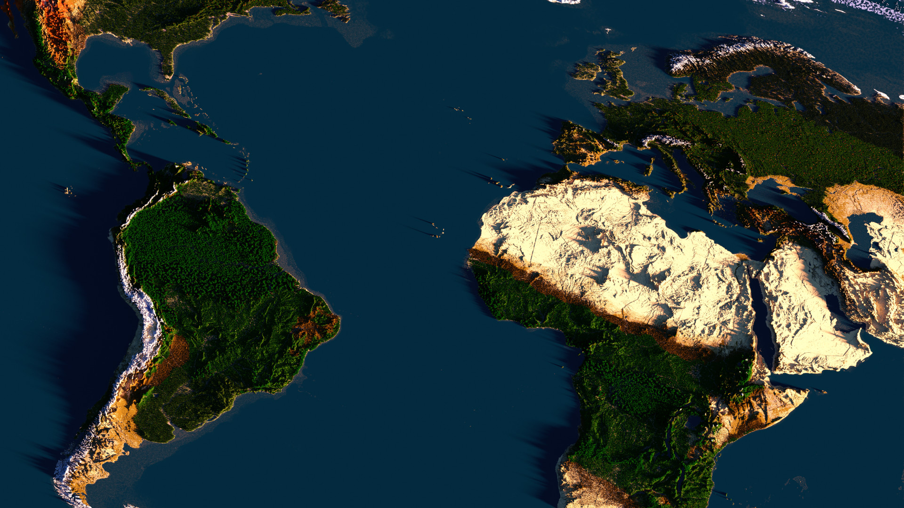

  

<h1 align="center">Chunky</h1>

Chunky is a Minecraft rendering tool that uses Path Tracing to create realistic images of your Minecraft worlds. 

---

# TEST 1

<!-- Slideshow container -->

  <!-- Full-width images with number and caption text -->
  

    
1 / 3

    
    
Minecraft Earth Map 1:1000 - 1 million Chunks

  

  

    
2 / 3

    
    
IHOU 2

  

  

    
3 / 3

    
    
le ultimate rtx - Material testing

  

  <!-- Next and previous buttons -->
  <a class="prev" onclick="plusSlides(-1)">&#10094;</a>
  <a class="next" onclick="plusSlides(1)">&#10095;</a>

<!-- The dots/circles -->

  
  
  

	<h2> Downloads </h2>
	<a href="/download.html" class="button"> Chunky 2.4.0  <btnsub>Minecraft 1.2.1 to 1.17.1</btnsub></a>

---

<!-- EOF -->
