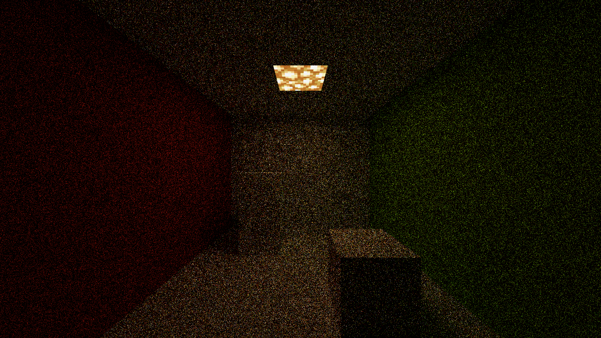

# Denosing

Image noise is an inevitable consequence of path tracing and as previously stated; Brute force was the conventional solution in the past.

Cornell Box rendered at 16 SPP with lots of image noise.

## More on SPP

Path tracing renders a sample by recursively tracing a random ray for each pixel through the scene. Theoretically, after an infinite amount of samples, a rendered image would converge on the perfect representation of a scene and not have any noise. Of course we can't actually render an infinite number of samples, so we must find a way to deal with image noise.

The simplest way to decrease noise is by simply rendering more SPP. The biggest disadvantage to this is that a 2x increase in SPP is required for a 2x decrease in noise. In other words, a 32 SPP image will need 32 more samples to decrease the noise in half, a 1,000,000 SPP image will need 1,000,000 more samples to decrease the noise by half. The time required increases exponentially and thus this is not a viable solution except for the most dedicated of renderers; Of course once the [OpenCL GPU acceleration plugin](https://github.com/alexhliu/ChunkyClPlugin) by Redox is "finished" this would make high sample count renders much more viable.

Cornell Box rendered at 1,024 spp.

Cornell Box rendered at 1,000,000 spp.

## Feature Images

Touched on in the [Introduction to Path Tracing](../) article is the concept of Feature Images. To explain this concept we shall describe a more generalised renderer. A rendered image can be understood in terms of a number of visible features: Shading, fogging, shadows, soft shadows, refraction, indirect illumination, etc. These images can either be combined to produce the final render or to provide addtional information about the 3D scene that would not be expressed by the final render. See [Rendering (computer graphics)](https://en.wikipedia.org/wiki/Rendering_(computer_graphics)) for more information.

By default Chunky does not have native support to export visible features, which can then be combined into the final render later, though Chunky does have a number of [Plugins](../../plugins/plugins) available which can provide addtional information about the 3D scene. This is still useful particularly in post processing processes.

* Albedo - Contains the approximate color of surfaces independent of illumination and viewing angle.

* Normal - Contains the shading normals of the surfaces.

* [Ambient Occlusion](https://en.wikipedia.org/wiki/Ambient_occlusion) (AO) - Describes how each pixel in a scene is exposed to ambient lighting.

* Depth Buffer / [Z-buffer](https://en.wikipedia.org/wiki/Z-buffering) - Represents depth information within the scene in grey scale. In Chunky black is closer to the camera with white further away.

### Extracting visible features from Chunky

It is possible to extract some visible features within Chunky through some clever toggling of various settings within Chunky. This images can be recombined in post.

* Sun Light illumination - [`Enable sunlight` and `Disable emitters`](../../user_interface/render/lighting), Set [`Sky mode settings`](../../user_interface/render/sky_and_fog/) to `Black`, and set `Fog density` to 0.0.

* Sky illumination - `Disable sunlight` and `Disable emitters`, Set `Sky mode settings` to back to whatever mode you had before, and set `Fog density` to 0.0.

* Emitters illumination - `Disable sunlight` and `Enable emitters`, Set `Sky mode settings` to `Black`, and set `Fog density` to 0.0.

* Fog only - `Disable sunlight` and `Disable emitters`, Set `Sky mode settings` to `Black`, and set `Fog density` to 0.0.

	

		
		
Sun Pass

	

	

		
		
Sky Pass

	

	

		
		
Emitter Pass

	

	

		
		
Composite

	

	

		
		
Typical Bake

	

## Contributions to Noise and a novel measure

AI Based Denoising
---
`TODO`

--8<-- "includes/abbreviations.md"
