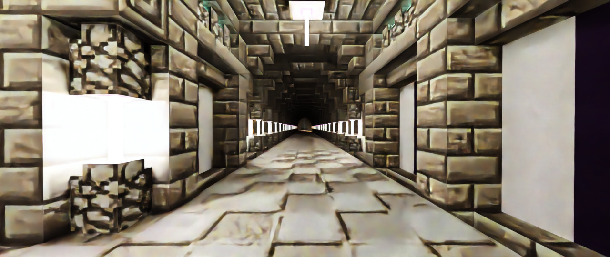

# Denoising

Image noise is an inevitable consequence of path tracing and as previously stated; Brute force was the conventional solution in the past.

Cornell Box rendered at 16 SPP with lots of image noise.

## More on SPP

Path tracing renders a sample by recursively tracing a random ray for each pixel through the scene. Theoretically, 
after an infinite amount of samples, a rendered image would converge on the perfect representation of a scene and not have any noise. Of course, we can't actually render an infinite number of samples, so we must find a way to deal with image noise.

The simplest way to decrease noise is by simply rendering more SPP. The biggest disadvantage to this is that a 2x increase in SPP is required for a 2x decrease in noise. In other words, a 32 SPP image will need 32 more samples to decrease the noise in half, a 1,000,000 SPP image will need 1,000,000 more samples to decrease the noise by half. The time required increases exponentially and thus this is not a viable solution except for the most dedicated of renderers; Of course once the [OpenCL GPU acceleration plugin](https://github.com/alexhliu/ChunkyClPlugin) by Redox is "finished" this would make high sample count renders much more viable.

Cornell Box rendered at 1,024 spp.

Cornell Box rendered at 1,000,000 spp.

## Feature Images

Touched on in the [Introduction to Path Tracing](../) article is the concept of Feature Images or Arbitrary Output Variables (AOVs). To explain this concept we shall describe a more generalised renderer. A rendered image can be understood in terms of a number of visible features: Shading, fogging, shadows, soft shadows, refraction, indirect illumination, etc. These images can either be combined to produce the final render or to provide additional information about the 3D scene that would not be expressed by the final render. See [Rendering (computer graphics)](https://en.wikipedia.org/wiki/Rendering_(computer_graphics)) for more information.

By default Chunky does not have native support to export visible features, which can then be combined into the final 
render later, though Chunky does have a number of [Plugins](../../plugins/plugins) available which can provide additional information about the 3D scene. This is still useful particularly in post-processing processes.

* Albedo - Contains the approximate color of surfaces independent of illumination and viewing angle.

* Normal - Contains the shading normals of the surfaces.

* [Ambient Occlusion](https://en.wikipedia.org/wiki/Ambient_occlusion) (AO) - Describes how each pixel in a scene is exposed to ambient lighting.

* Depth Buffer / [Z-buffer](https://en.wikipedia.org/wiki/Z-buffering) - Represents depth information within the scene in grey scale. In Chunky black is closer to the camera with white further away.

### Extracting visible features from Chunky

It is possible to extract some visible features within Chunky through some clever toggling of various settings within Chunky. This images can be recombined in post to reproduce the final render or, more likely, to post process each contributional feature separately.

* Sunlight illumination - [`Enable sunlight` and `Disable emitters`](../../user_interface/render/lighting), Set 
  [`Sky mode settings`](../../user_interface/render/sky_and_fog/) to `Black`, and set `Fog density` to 0.0.

* Sky illumination - `Disable sunlight` and `Disable emitters`, Set `Sky mode settings` to back to whatever mode you had before, and set `Fog density` to 0.0.

* Emitters illumination - `Disable sunlight` and `Enable emitters`, Set `Sky mode settings` to `Black`, and set `Fog density` to 0.0.

* Fog only - `Disable sunlight` and `Disable emitters`, Set `Sky mode settings` to `Black`, and set `Fog density` to 0.0.

	

		
		
Sun Pass

	

	

		
		
Sky Pass

	

	

		
		
Emitter Pass

	

	

		
		
Composite

	

	

		
		
Typical Bake

	

One of the main uses of this splitting and separate processing of each contribution is to only denoise those that are most noisy. Most denoising methods employ some form of destructive blurring which can reduce fine detail. Furthermore, given how many samples might be required to render the final render, having this much control to touch up the contributions of different light sources is extremely powerful and can save time.

## Artificial Intelligence (AI) accelerated denoising

There are a number of denoising solutions that exist and have a multitude of pros and cons; typically these methods resort to blurring of some method. [Examples](https://en.wikipedia.org/wiki/Noise_reduction#In_images).

AI accelerated denoisers use a fundamentally different approach called deep learning. The AI is trained to distinguish between real image details and noise in ray tracing based rendering applications, from a number of 3D scenes from 1 SPP to fully converged, allowing it to not only remove noise but recover detail. This drastically reduces the amount of necessary SPP by even multiple orders of magnitude. These AI denoisers can operate solely on the noisy final image straight out of a ray traced renderer however their best results come from providing feature images (/AOVs) which provide additional information to the AI.

For Chunky we have leMaik's [Denoising plugin](https://github.com/chunky-dev/chunky-denoiser) which both provides 
the required renderers for the two additional feature images typically recommended, being the albedo and normal maps, but it is also capable of automatically denoising using [Intel Open Image Denoise (OIDN)](https://www.openimagedenoise.org/). We should note that this denoiser is not restricted to Intel platforms as any CPU with support for at least SSE4.1 or Apple Silicon is supported. Otherwise there is the NVidia AI-accelerated Denoiser (NVAIDN), which is part of OptiX, which requires an NVidia GPU of Maxwell architecture or newer plus at least driver 465.84 or higher. [Standalone NVAIDN](https://github.com/DeclanRussell/NvidiaAIDenoiser).

The albedo map:

The Albedo map is a feature image that provides the largest quality bump to the denoiser. It’s basically just a representation of the texture information within the scene independent of shading (lighting) or viewing angle. This map tends to help restore texture details.

The normal map:

The Normal map is another feature image that can help. In order to use a Normal map you need to provide the Denoiser with the Albedo map first. This map tends to help restore block shape.

Scene rendered to 64 SPP:

Denoised image:

The higher the SPP the scene is rendered to, the better the denoiser will perform.

An important disclaimer is needed regarding AI accelerated denoisers - **They aren't magic** - If you do not provide the addtional feature images, and/or the noisy image you are trying to denoise is too challenging for the AI to handle, it will result in visual artifacts, such as deformed blocks and blurred textures. This gives some denoised renders an "oil painting" effect. If possible provide the additional feature images or raise the SPP.

--8<-- "includes/abbreviations.md"
