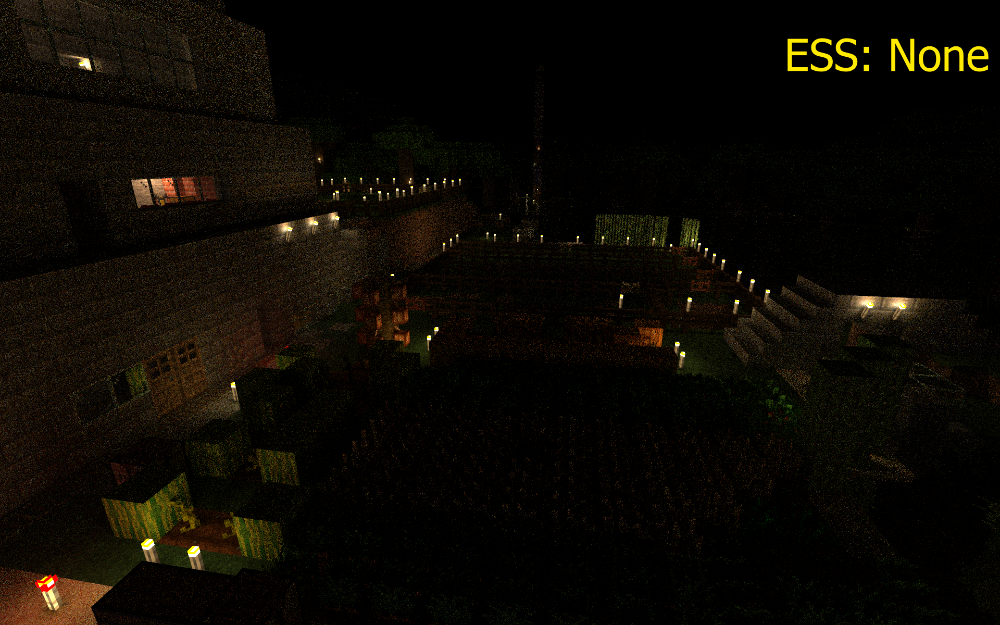
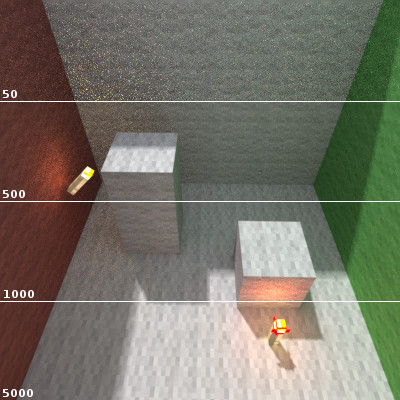

# Introduction

## Path Tracing

[Path Tracing](https://en.wikipedia.org/wiki/Path_tracing) is a rendering algorithm under the umbrella of [ray 
tracing](http://en.wikipedia.org/wiki/Ray_tracing_(graphics)) in which rays are cast from a virtual camera and traced through a simulated scene. Ray tracing is most similar to how the world around you works. Photons are emitted from light sources and bounce around before they hit your eyes. However, this is extremely computationally intensive and most real-time computer graphics have long used a technique call rasterization. Please read the following NVIDIA blog post if you want more information on the [differences between Ray Tracing and Rasterization](https://blogs.nvidia.com/blog/2018/03/19/whats-difference-between-ray-tracing-rasterization/).

Path tracing uses random sampling to incrementally compute a final image. The random sampling process makes it possible to render some complex phenomena which are not handled in regular ray tracing, but it generally takes longer time to produce a high quality path traced image. The random sampling in path tracing causes noise to appear in the rendered image. The noise is removed by letting the algorithm generate more samples, i.e. color values resulting from a single ray. A more in-depth explanation of the path tracing algorithm is given below or watch the following video on [Disney's Practical Guide to Path Tracing](https://youtu.be/frLwRLS_ZR0).

---

## Random sampling

Chunky uses the [Monte Carlo method](https://en.wikipedia.org/wiki/Monte_Carlo_method) where rays are distributed randomly within each pixel in camera space and at each intersection with an object in the scene a new reflection ray, pointing in a random direction, is generated. After some number of bounces, clamped by [Ray Depth](../user_interface/render/advanced/#some-qualityperformance-related-options), each ray eventually either exits the scene or is absorbed. When a ray has finished bouncing about in the scene a *sample* value is calculated based on the objects the ray bounced against. The sample value is added to the average for the source pixel.

The samples in a path-traced image are distributed evenly over all pixels. The color of each pixel is the average of all the sample values computed for that pixel. The random components in path tracing cause the rendered image to appear noisy and smaller objects are harder to hit. The noise decreases over time as more and more samples are calculated which we call convergence.

---

## Samples Per Pixel (SPP)

The defining factor for render quality is the number of Samples Per Pixel (SPP).

<video src="../img/rendering/spp-compare.webm" preload="auto" controls autoplay loop>
	
<a href="https://chunky.llbit.se/spp-compare.gif"> Fallback gif </a>

</video>

The higher SPP you have in a rendered image the less noise will be noticeable. However, the added quality per sample 
decreases the more samples you have already (since each sample is just contributing to an average over all samples).  The difference in image quality between, for example, 20,000 SPP and 21,000 SPP will not be as noticeable as between 1,000 SPP and 2,000 SPP.

Sunlight does not typically require a high SPP to give a nice image; This is due to Sunlight sampling or, it's more technical name, Next Event Estimation (NEE) which is enabled by default. Outdoor scenes can be rendered with relatively low SPP if sunlight is enabled. Emitters (torches, lava, glowstone, pumpkins, etc.) require a lot more samples to reduce the noise as NEE is not enabled by default due to a multitude of reasons which will be covered later. Outdoor scenes with emitters require more samples than a sunlight only scene and indoor scenes, or similar, in low-light environments require a lot more samples.

---

## Render time

There is no definite answer to how long it will take to render a scene. The general guideline is that the longer you render an image, the better it will become. Take into account the diminishing returns explained above.

The time required to render a nice looking image depends on how well-lit the scene is, how many Samples Per Second (SPS) the renderer can produce, which depends on how fast your CPU is and the scene complexity, and how many pixels the canvas has. Scene complexity has no real measure outside of scene size (loaded chunks and entities), if fog is enabled, if you are using a HDRi skymap, the Ray Depth, etc. Not all options impact performance. Scaling the canvas has an effect on render time proportional to the pixel area of the canvas. An image of 800 by 800 pixels will take four times as long time to achieve the same quality as an image of 400 by 400 pixels since the total number of pixels has quadrupled. If your renders are taking too long, you can reduce the canvas size for quicker results.

---

## More about noise

Small but bright light sources, such as torches, add a lot of noise to a scene. It takes especially long time to render a scene lit mostly by a few torches. This is an unfortunate and unavoidable disadvantage of the Path Tracing rendering method.

The reason for this effect is based on the low probability for each sampled light path to include the torches, versus the high luminance of the object. The final render takes the average of all sampled values, but the average can be "too high" for a long time because of the high luminance. The average will decrease over time, but for a while there may be one pixel that has been lit by a particular light source in a neighbourhood of several pixels that will stand out sharply against the others that have not yet been lit by the same source, hence the bright dots seen above at low sample counts.

Torches add much noise to the scene and can take long to render. This scene was rendered to 128 SPP.

Full block emitters, such as glowstone, have a much higher probability for a sampled light path to include the glowstone, because it is much larger. That means noise is reduced in much fewer samples than with torches. This scene was rendered to 128 SPP. Note how much less noise exists in this scene than the previous one.

Outside of just brute forcing more samples to reduce noise there are a number of methods you can use to reduce noise or converge a render sooner. For more information please read the next article on [Denoising](denoising).

---

## Emitter Sampling Strategy (ESS)

As covered before: With every intersection the sun is sampled due to NEE adding its contribution to the ray without the need for random sampling. This is one of the main reasons why the convergence of scenes lit by the sun (and sky) occurs so quickly. Emitters on the other hand need to be directly hit for them to contribute which has a lower probability of occurring; especially with smaller emitters like torches.

Emitter Sampling Strategy (ESS) enables an "optimised" NEE, similar to the sampling which the sun uses, and, in theory, should lead to faster convergence.

Whereas there is only a single sun present in the scene there can be multiple emitters and those at distances where they will not contribute much to the pixel being sampled- For this we have the emittergrid which holds the positions of all the loaded emitters within cells. Each cell of the grid holds the position of the emitters present in this cell and in neighboring cells. As such when we want to sample emitters close from an intersection point, we only have to look at the cell where this intersection falls in and we will find every emitter we are interested in. That way the cost of processing the additional samples is minimalised compared to if we would sample all emitters. The reason we need to hold emitter of neighboring cells is because emitters a few block away from the intersection point to have an effect even if it falls in a different cell.

With ESS:ONE only a single emitter is sampled per intersection within the cell plus adjacent. For ESS:ALL every emitter in the cell plus adjacent are sampled per intersection. Sampling emitters increases the rendering cost but reduces the required samples. ESS:ONE tends to be very similar to ESS:NONE with ESS:ALL being the "slowest" but potentially fastest to converge- ESS:ALL also tends to result in much brighter images than NONE/ONE so a reduction in exposure or emittance value is required to compensate for this. This is known about and we need to fix some maths to solve it.

With this every emitter at cellSize or fewer blocks from the intersection points will always be found. The maximum 
distance where an emitter can be found in some cases is `2*cellSize-1 blocks away`. Reducing this value too low can boost performance or lead to light cut-off.

The following renders demonstrate the effects of ESS. Each was rendered for one hour. Render speed depends on your CPU and your Chunky settings.

A scene rendered to 610 SPP with ESS set to *None*.

The same scene rendered to 460 SPP with ESS set to *One*.

The same scene rendered to 45 SPP with ESS set to *All*.

ESS: None is the quickest to render, but has the most noise. ESS: One is somewhat slower, but noise is reduced and the image is brighter overall. ESS: All is by far the slowest to render, but it produces the least noise. It also produces much brighter renders compared to ESS: None and ESS: One, so turn down either the `Emitter intensity` or the `Exposure` to compensate.

ESS also has the unfortunate problem of projecting the lighting as a ghost image of the emitter's texture onto other surfaces. This is due to a bug, and it will be fixed in a future release.

---

## Data structures

Chunky uses two data structures to hold world data once loaded. These structures are chosen to help accelerate performance while path tracing.

### Octree

Chunky makes use of a [Sparse Voxel Octree (SVO)](https://en.wikipedia.org/wiki/Sparse_voxel_octree) (also see [Octree](https://en.wikipedia.org/wiki/Octree)) to store loaded world data of blocks for renders in a "bi"nary tree like structure with eight children/siblings instead of two. Use of a SVO grants Chunky two main advantages; Firstly that only pixels that are displayed are computed. Secondly is that interior voxels or blocks, which are fully enclosed by other voxels, are not included in the SVO which limits the amount of system memory (RAM) required for the world.

There are a few different Octrees that are available within Chunky being NODE (legacy), PACKED (default), and BIGPACKED all which have different pros and cons. Available Octrees can be expanded via [Plugins](../plugins/plugins) such as aTom3333's [Octree plugin](https://github.com/aTom3333/chunky-octree-plugin).

### Bounding Volume Hierarchy (BVH)

Entities and objects larger than a single block in size are stored within a [Bounding Volume Hierarchy (BVH)](https://en.wikipedia.org/wiki/Bounding_volume_hierarchy) which is a similar tree like structure to the previously mentioned octree though it stores geometric objects.

There are a few different BVH build methods available within Chunky being SAH_MA (default), SAH, and MIDPOINT all which have different pros and cons. Available BVHs can be expanded via [Plugins](../plugins/plugins) such as aTom3333's [BVH plugin](https://github.com/aTom3333/chunky-bvh-plugin).

---

## Renderers

Chunky's path traced renderer was built back in 2010 and has been slowly improved over the years. At the time a CPU based path tracer made most sense for a number of reasons including the required memory to load a Minecraft world compared to the available RAM and Video RAM (VRAM). A lot has changed since then.

It is possible to switch the renderer in Chunky using [Plugins](../plugins/plugins). A renderer can be used to render feature images like albedo maps (base color), normal maps, depth maps, etc. or an alternative rendering algorithm. The two most notable in this category are leMaik's [Denoising plugin](https://github.com/chunky-dev/chunky-denoiser), which leverages Artificial Intelligence (AI) to smartly denoise noisy images, and Redox's [ChunkyCl plugin](https://github.com/alexhliu/ChunkyClPlugin), which adds experimental GPU path tracing which can drastically accelerate rendering.

In addition, there is [Chunky Cloud](https://chunkycloud.lemaik.de/) which is a distributed cloud rendering service 
in beta. Chunky Cloud is a community driven cloud rendering platform that requires community donated render nodes.

---

## SPP Comparisons

An indoor scene rendered with increasing SPP. The white numbers show SPP:

	

		
	

	

		
	

	

		
	

---

## Image formats and color

Internally Chunky stores the canvas with three "doubles" per pixel. Doubles are Double-precision floating-point format (sometimes called FP64 or float64). Storing a full double precision float for each channel (8 bytes × 3 = 24 bytes) is a burden for modern systems so compression is typically used. See the [.dump format](scene_format). Standard Dynamic Range (SDR) typically have 24 bits per pixel / 8 bits per color. High Dynamic Range (HDR) images are regarded as anything with an increased bits per color/pixel.

- JPEG/JPG (SDR) - 24 bits per pixel and uses a lossy form of compression based on the discrete cosine transform which typically provides 10:1 compression. Smallest file size and often used for photos on websites.

- PNG (SDR) - 24 bits per pixel and a lossless format. Often maintains original quality with relatively small file size often used on websites.

- TIFF (HDR) - Upto 96 bits per pixel or 32 bits per color. "RAW" format.

- PFM (HDR) - 96 bits per pixel or 32 bits per color. "RAW" format. Mainly used in conjunction with the [Denoiser plugin](../plugins/plugins.md#denoising-plugin) and OIDN.

- HDR (HDR) - The HDR/RGBE format stores pixels as one byte for each RGB (red, green, and blue) value with a one 
  byte shared exponent. Thus it stores 32 bits per pixel. This results in a 6:1 compression, at the expense of reduced colour fidelity.

--8<-- "includes/abbreviations.md"
