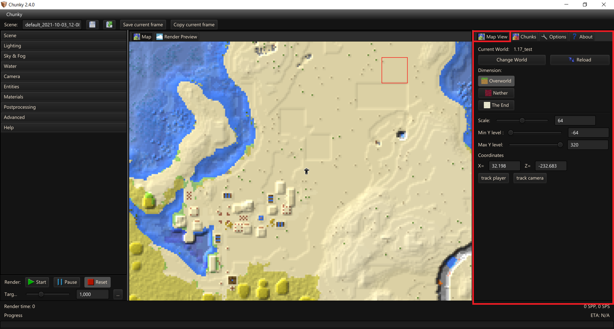
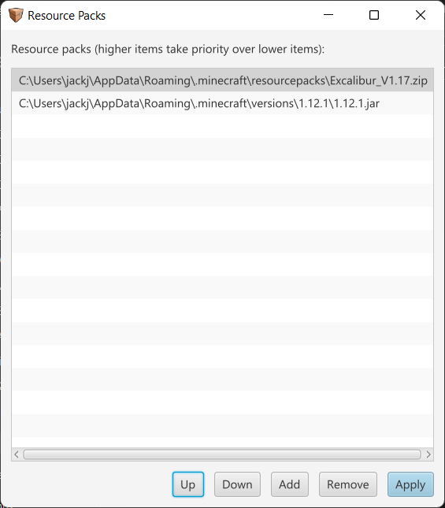

# Chunky

Chunky's UI is built using JavaFX and is seperated into three panes which can be slide to increase/decrease screenspace of the different components. These panes often have tabs which contain addtional controls. There are three main panes; The left pane handles Render Controls (to be covered on a seperate page), the middle pane is for previews (both 2D and 3D), and the right pane is for general options.

---

## Map

Chunky displays an overhead 2D view of your world within the center pane under the `Map` tab, highlighted in red in the above image, and should be the default view when you launch Chunky. While this view can be used for mapping purposes it's primarily used for making chunk selections for renders much easier. There are two available modes for the Map; At (map) `Scale` 13 or greater you will be shown individual blocks and for a `Scale` of 12 or under you will be displayed a biome view.

### Controls

- `Left click` and drag to move the viewport (also see Map View tab)
- `Left click` to select/deselect a Chunk (at `Scale` 16 or higher) or a Region (at `Scale` 15 or lower)
- `Shift` + `Left click` and drag to create a draggable rectangular chunk selection. Note - Shift does not need to be held continuously only Left click does; On release selection of Chunks is made.
- `Ctrl` + `Shift` + `Left click` and drag to create a draggable unselection rectangular area
- `Mouse wheel` to change Map Scale (also see Map View tab)
- `Right click` to open a menu with some Selection and Render related options

---

<table class="tg">
	<thead>
	  <tr>
		<th class="left">  Prior to left clicking an outline of the highlighted Chunk will be shown.</th>
		<th class="left">  After left clicking the outline will be filled in and Selected.</th>
	  </tr>
	</thead>
	<tbody>
	  <tr>
		<td class="left">  Prior to left clicking an outline of the highlighted Region will be shown.</td>
		<td class="left">  After left clicking the Region outline will be filled in and Selected.</td>
	  </tr>
	  <tr>
		<td class="left">  Draggable selection</td>
		<td class="left">  Right click menu</td>
	  </tr>
	</tbody>
</table>

---

### Biome view

As mentioned before, at `Scale` 12 or below Chunky will auto display a biome overview opposed to a block overview.

---

#### Right click menu

The right click menu provides some selection and render related controls.

- `New scene from selection` - Create a new 3d scene from selection
- `Clear selection` - Clears the selection
- `Move camera here` - Moves camera to the coordinates of the right click
- `Select camera-visible chunks` - Selects chunks visible to 3d camera frustum and within the Maps current viewport. An example of the view frustum can be seen below.

---

## Map View tab

This tab allows you to pick the world and dimension you wish to view and a few options on how to view it.

- `Current World` - Displays the currently selected Minecraft world
- `Change World` - Opens prompt to select a Minecraft world

- `Reload` - Reloads currently selected Minecraft world
- `Dimension` - Currently selected dimension is highlighted
- `Scale` - Controls map Scale
- `Min Y level`
- `Max Y level`
- `Coordinates` - Provides X,Z coordinates of the Maps view
- `track player` - Centers Maps view on players position
- `track camera` - Centers Maps view on 3D Cameras position

### Select World

- `World list` - Reads the worlds in your Minecraft directory and displays a table of results. World name, Directory, (Game)Mode, and Seed.
- `Change world directory` - Allows you to pick a different directory
- `Browse for another world` - Allows you to locate a world
- `Load selected world` - Loads selected world

---

## Chunks Tab

This tab provides access to chunk related features.

- `Clear selection` - Clears current selection

- `Export chunks to ZIP` - Exports selected chunks to a .ZIP archive
- `Export view to PNG` - Exports current map view to a .PNG image

- `Delete selected chunks` - WARNING - Delets currently selected chunks. Chunky is **NOT** responsible if you do not have a backup.

---

## Options Tab

This tab has a few options in it...

- `Edit resource packs` - Allows you to select a Resource Pack `.zip` or Minecraft `.jar` for textures.
- `Disable default textures (needs restart)`
- `Single color textures (needs restart)` - Averages block textures into single color.
- `Show launcher when starting Chunky`
- `Open Scenes Directory` - Opens the directory Chunky uses to store it's scenes.
- `Change Scenes Directory` - Changes folder used for the scenes directory.

---

### Resource Packs

Should be noted that the phrasing here is confusing. The load order is bottom to top meaning that packs on top will override packs on the bottom.

- `Up` - Move selected pack up
- `Down` - Move selected pack down
- `Add` - Add new pack
- `Remove` - Remove selected pack
- `Apply` - Apply changes

---

#### How to correctly add resource packs

 1. `Add`

 2. Select either a `.zip` or a minecraft `.jar` (found within .minecraft/versions/x/x.jar)

	<table class="tg">
	<thead>
	  <tr>
		<th class="left">  </th>
		<th class="left">  </th>
	  </tr>
	</thead>
	</table>

 3. `Left Click` a resource pack in the list and use `Up`/`Down` to move resource packs. Packs higher in the list will have their textures take priority over those below, including the latest Minecraft .jar which should be loaded regardless (would be noted in the `debug console`).

	

 4. `Apply`

 5. You may need to to hit `Reload` under the Map View Tab and/or `Reload Chunks` if you have an active render; This should be done automatically...

---

## About Tab

The About tab has a few useful links in addtion to Chunky's copyright and credits.
