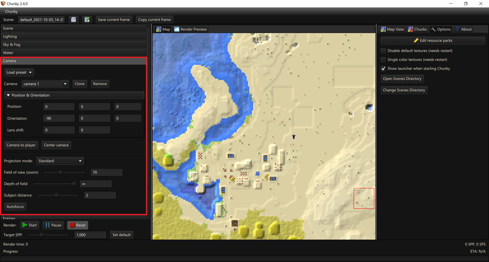

# Render Controls - Camera

## Camera General

- `Load preset` - Loads a camera preset: `Isometric [NW, NE, SE, SW]`, `Skybox [Right, Left, Up, Down, Front (North), Back]`.

	- `Isometric` modes set the camera `projection mode` to `parallel` with the camera aimed down at 45 degrees towards the center of the currently loaded chunks. Yaw depends on preset selected.
	
	- `Skybox` - From the center of the currently loaded chunks look towards that cardinal direction and sets the FoV to 90 degrees.

- `Camera` - Allows a scene to have multiple independent cameras which can have different properties.

	- `Clone` - Clones selected camera

	- `Remove` - Removes selected camera

---

## Camera Controls

- `Position & Orientation`

	- `Position` - Defines the X, Y, Z, coordinates of the Camera. These coordinates correlate with the Minecraft world positions.

	- `Orientation` - Yaw, Pitch, Roll

	- `Lense shift` - Horizontal lense shift and Vertical lense shift - Relative to canvas height.
	
- `Camera to player` - Moves the selected camera to the "players" position and inherit the direction the player is facing. Which one? No clue.

- `Center camera` - Moves the camera to the centre of the loaded world and faces the camera to the ground.

### Projection modes

- `Projection mode`

	- `Standard` - Default pinhole projection works like a normal camera.
	
	- `Parallel` - Removes all perspective such that all blocks are the same size regardless of distance to camera.
	
	- `Fisheye` - This projection makes is like an extreme wide angle lens which distorts images.
	
	- `Stereographic` - Stereographic projection maps points on the sphere to a plane. If you want tiny planets this is one good way to achieve them.
	
	- `Panoramic (equirectangular)` - Similar to standard/pinhole projection.
	
	- `Panoramic (slot)` - Behaves like a pinhole camera in the vertical direction, but like a spherical one in the horizontal direction.
	
	- `Omni-deirctional Stereo (left/right eye)` - This projection can create distinct images for viewing on VR devices by factoring the inter-pupillary distance in. Some lines may appear slightly curved.

### Depth of Field

- `Field of view (zoom)` - Controls the field of view in the virtual camera. Lower causes a narrower field of view (higher magnification) and high value will result in a wider field of view (low magnification). 70 is the default value, which corresponds with Minecraft's normal field of view.

- `Depth of field` - The depth of field controls the level of blurriness of objects in the scene which are not in focus. A low value will result in lots of blur while a low value will leave the whole image looking fairly sharp. Setting this value to infinite will completely remove the depth of field making the whole image perfectly sharp, this is also the default setting.

- `Subject distance` - Focal offset decides how far the focal plane is from the camera. If you want to focus an object that is 20 blocks away the focal plane should be set to 20. Estimating the distance (in blocks) to a given object is a good way to make an initial guess for the correct focal offset setting. Or by using the "Autofocus" button below. Objects at this range will appear perfectly sharp even if DOF is set to a low value.

- `Autofocus` - Sets the Focal Offset and Depth of Field to the cross-hair which is typically in the middle of the Render Preview unless `Set Target` is used.

--8<-- "includes/abbreviations.md"
