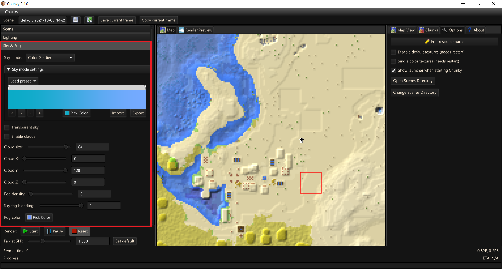

# Render Controls - Sky & Fog

## Sky Mode

- `Sky mode` - Simulated, Solid Color, Color Gradient, Skymap (panoramic), Skymap (spherical), Skybox, and Black - These options are expanded on below.

---

- `Sky mode settings`

	- `Simulated` - Simulates a sky
	
		- `Sky Mode` - This is the default sky mode that attempts to simulate a real-life sky. There are currently 2 simulation models: Preetham and Nishita.

			Preetham is a faster, approximate simulation of daytime skies. It is most similar to Minecraft.

			Nishita is a slower, simulation of all skies. It is most photorealistic but may be challenging to set up 
		  since it is not rendered below the horizon. It is best for low sun angles, such as a sunrise or sunset.
	
		- `Horizon offset` - can be adjusted to push the simulated horizon below the real horizon.

	- `Solid Color` - Set the sky to a solid color.
	
	-  `RGB picker`
	
	- `Color Gradient` - Smooth blended gradient between two or more colors from the horizon to the peak of the sky

		
	
	- `Skymap (panoramic)` - Select an equiangular projected skymap; these are the most common type. Equirectangular skymaps can have a 90° or 180° vertical resolution. With 90° vertical resolution the skymap will only cover the sky above the horizon, so it is mirrored at the horizon. If the skymap has 180° vertical resolution the mirroring is not needed: the skymap will cover both sky and ground. Panoramic sky textures either taken in real life or generated by other applications can be used. HDR skymaps are supported.

		- `Load skymap` - Opens a file picker

		- `Vertical resolution` - Half (mirrored) ie 360x90 or Full 360x180

		- `Skymap rotation` - Rotates the skymap horizontally.

	- `Skymap (spherical)` - These are not common and we do not have any information.

		- `Load skymap` - Opens a file picker

		- `Skymap rotation` - Rotates the skymap horizontally.
	
	- `Skybox` - Load up to six textures which get mapped onto a cuboid to act as a sky ([more information](https://en.wikipedia.org/wiki/Skybox_(video_games))).
	
		- `Up`, `Down`, `Front`, `Back`, `Left`, `Right` - Opens a file picker

		- `Skymap rotation` - Rotates the skybox horizontally.
		
	- `Black` - Sets the sky to a solid Black colour. This is redundant but quick and easy to use.

- `Transparent sky` - Makes the sky transparent.

---

## Clouds and Fog

- `Enable clouds` - Toggles Minecraft style, blocky clouds. Currently, only renders as flat planes, similar to clouds seen in Minecraft's fast graphics mode.

- `Cloud size` - Controls the scaling of the clouds; The position of the clouds will change too due the clouds being based on a texture.

- `Cloud X` - Shifts clouds along X axis.

- `Cloud Y` - Shifts clouds along Y axis / sets the height the clouds render at.

- `Cloud Z`- Shifts clouds along Z axis

- `Fog density` - Logarithmic scaled Fog density. The default of 0 is off. Scales between 0.001 and 1.0. Depending on scene composition the impact fog density can have is variable. The thickness of the fog is related to the amount of direct sunlight that has passed through it. The effect can only be seen against objects in the world, light paths that lead to the sky will completely ignore this fog, regardless of whether sunlight has passed through it or not. This option can advantageously be used to simulate the rays of sun falling through the window of a dusty library or the sun rays entering a misty cavern. You may need to manually enter values into the text field to access densities between 0.0 - 0.001 and 1.0+.

- `Sky fog blending` - Controls the amount that Fog will bleed into the sky. This is not impacted by `Fog density` and can be used to help avoid masking a `Sky Texture` while still blending.

- `Fog color` - Sets the fog color.

--8<-- "includes/abbreviations.md"
