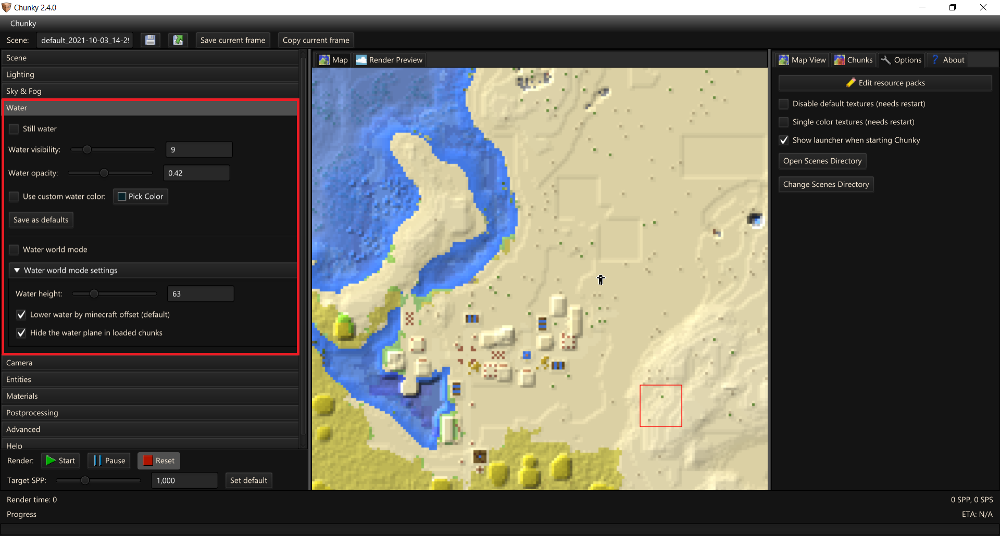

# Render Controls - Water

## Water controls

- `Still water` - Disables the wavy water ripples.

- `Water visibility` - Controls the distances rays can travel in water before being terminated.

- `Water opacity` - Controls the opacity of the water; 0 for clear and 1 for solid.

- `User custom water color` - Toggle; Otherwise will use biome water color

- `Pick color` - Lets you pick the custom water color.

---

## Water World

- `Water world mode` - Toggles an infinite water plane.

	- `Water height` - Sets the height of the water world.
	
	- `Lower water by Minecraft offset` - Water in Minecraft isn't exactly at block level, this applies an offset so there aren't any gaps.
	
	- `Hide the water plane in loaded chunks`

--8<-- "includes/abbreviations.md"
