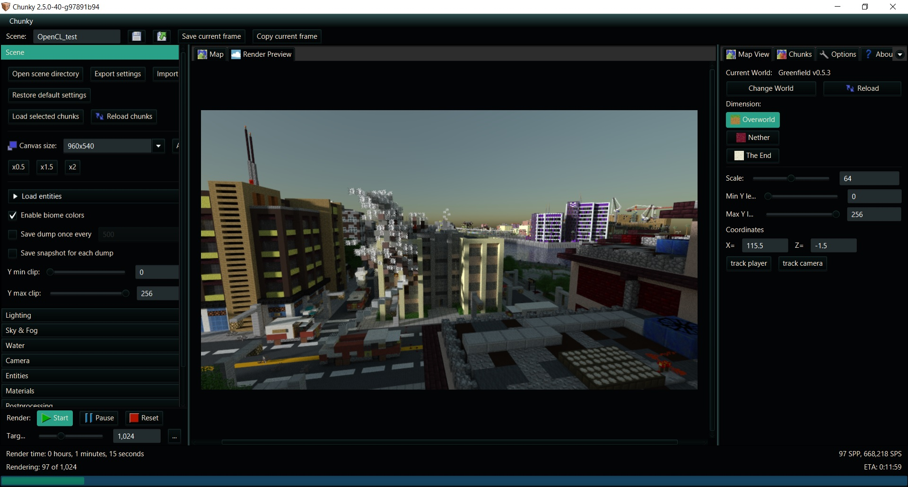

# Theming Chunky via Style.css

Chunky, and not Chunky Launcher, may be styled by adding a custom `style.css` to the Settings directory (by default it is `.chunky`). This allows you to customise the theme of Chunky for whatever reason you may want to; Ranging from matching your system theme to... more extremes...


## Template

Below you will find a template style.css which you can use as a basis for your theme. This [style.css](https://github.com/chunky-dev/chunky/blob/master/chunky/src/res/style.css) is used as the default for Chunky and can be found within the Chunky GitHub repository.

```
.root {
    -fx-base: rgb(30,30,30);
    -fx-background: rgb(20,20,20);
    -fx-control-inner-background: rgb(40, 40, 40);
    -fx-accent: orange;
    -fx-focus-color: orange;
}

ProgressBar {
    -fx-control-inner-background: rgb(30, 30, 30);
    -fx-progress-color: orange;
}

ToggleButton:selected {
    -fx-background-color: rgb(80,80,80);
}

Button {
    -fx-text-fill: #faebd7;
}

ToggleButton {
    -fx-text-fill: #faebd7;
}

CheckBox {
    -fx-text-fill: #faebd7;
}

Label {
    -fx-text-fill: #faebd7;
}

Text {
    -fx-fill: #faebd7;
}

Hyperlink {
    -fx-text-fill: orange;
    -fx-underline: false;
}

Hyperlink:visited {
    -fx-text-fill: orange;
}

Hyperlink:hover {
    -fx-text-fill: #faebd7;
    -fx-underline: true;
}

.text-field.invalid {
    -fx-text-fill: #FF434A;
    -fx-text-box-border: #FF434A;
    -fx-focus-color: #FF434A;
}

.menu-item:disabled:focused {
    -fx-background: unset;
    -fx-background-color: transparent;
}

.menu-item:disabled:focused > .label {
    -fx-text-fill: white;
}
```


### Beyond the template

Customisation is not limited to what is in the template. An example would be with `fx-background-image` which can be used to add images or gifs to the UI. For full documentation please see the [JavaFX CSS Reference Guide](https://docs.oracle.com/javafx/2/api/javafx/scene/doc-files/cssref.html#typecolor).


---

## Example Themes

### Light


*Created by jackjt8 - Sorry*

```
.root {
    -fx-base: rgb(225,225,225);
    -fx-background: rgb(235,235,235);
    -fx-control-inner-background: rgb(215, 215, 215);
    -fx-accent: orange;
    -fx-focus-color: orange;
}

ProgressBar {
    -fx-control-inner-background: rgb(225, 225, 225);
    -fx-progress-color: orange;
}

ToggleButton:selected {
    -fx-background-color: rgb(175,175,175);
}

Button {
    -fx-text-fill: #080501;
}

ToggleButton {
    -fx-text-fill: #080501;
}

CheckBox {
    -fx-text-fill: #080501;
}

Label {
    -fx-text-fill: #080501;
}

Text {
    -fx-fill: #080501;
}

Hyperlink {
    -fx-text-fill: orange;
    -fx-underline: false;
}

Hyperlink:visited {
    -fx-text-fill: orange;
}

Hyperlink:hover {
    -fx-text-fill: #080501;
    -fx-underline: true;
}

.text-field.invalid {
    -fx-text-fill: #FF434A;
    -fx-text-box-border: #FF434A;
    -fx-focus-color: #FF434A;
}

.menu-item:disabled:focused {
    -fx-background: unset;
    -fx-background-color: transparent;
}

.menu-item:disabled:focused > .label {
    -fx-text-fill: white;
}
```

### Nice Blue


*Created by EmeraldSnorlax - MIA*

```
.root {
    -fx-base: rgb(2, 5, 5);
    -fx-background:  rgb(2, 5, 5);
    -fx-control-inner-background: #222B2E;
    -fx-accent: rgb(17,122,101);
    -fx-focus-color: rgb(17,122,101);
}

ProgressBar {
    -fx-control-inner-background:  rgb(21,67,96);
    -fx-progress-color:  rgb(17,122,101);
}

ToggleButton:selected {
    -fx-background-color: #29A189;
}

Button {
    -fx-text-fill: #faebd7;
}

ToggleButton {
    -fx-text-fill: #faebd7;
}

CheckBox {
    -fx-text-fill: #faebd7;
}

Label {
    -fx-text-fill: #faebd7;
}

Text {
    -fx-fill: #faebd7;
}

Hyperlink {
    -fx-text-fill: rgb(17,122,101);
    -fx-underline: false;
}

Hyperlink:visited {
    -fx-text-fill: rgb(17,122,101);
}

Hyperlink:hover {
    -fx-text-fill: rgb(21,67,96);
    -fx-underline: true;
}

.text-field.invalid {
    -fx-text-fill: #FF434A;
    -fx-text-box-border: #FF434A;
    -fx-focus-color: #FF434A;
}

.menu-item:disabled:focused {
    -fx-background: unset;
    -fx-background-color: transparent;
}

.menu-item:disabled:focused > .label {
    -fx-text-fill: white;
}
```


--8<-- "includes/abbreviations.md"
